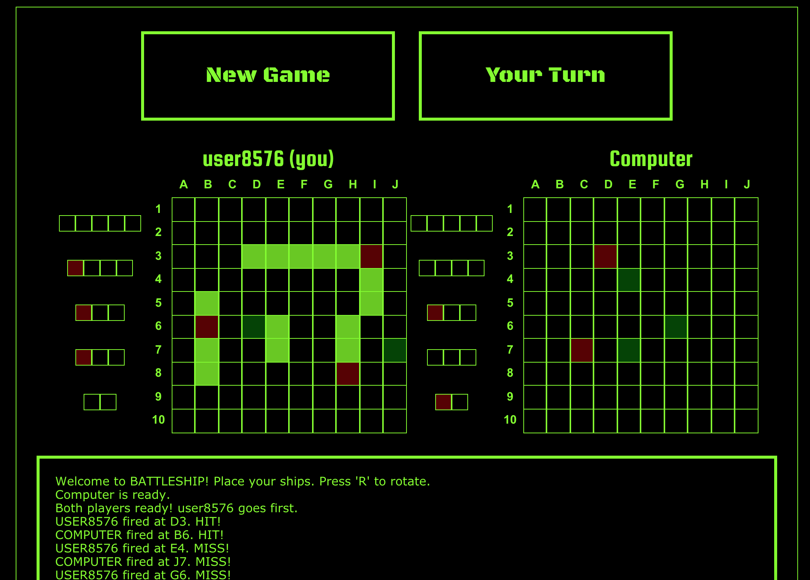
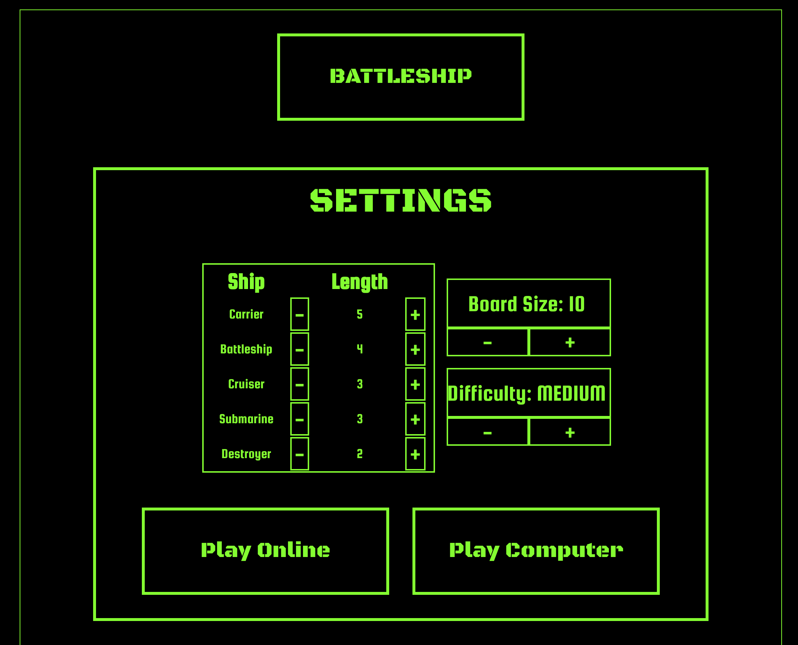

# Battleship-React

* An online battleship clone. Play against your friends or the computer! [Currently deployed to Heroku](https://alex-battleship.herokuapp.com/).

## Project Overview

* This project was built off my [jQuery-driven battleship game](https://github.com/alex-hladun/battleShip). I wanted to learn more about TypeScript, Redux, and add WebSocket functionality to enable online play (and hide the game logic from the players to prevent cheating). I also used a TDD approach to coding the back-end logic and applied 80% + code coverage to all the React components. This project was bootstrapped with [Create React App](https://github.com/facebook/create-react-app). I used Redux-Toolkit to manage state, which allows for 'mutable code' within the reducer slices. The back-end uses Express and socket.io. I used an OOP/class-based approach to manage the game logic.

## Installation

* Clone the repo and 'npm init'. You will also need to change the **'npm start'** value from **'node ./server/server.js'** to **'react-scripts start'** in order to run locally (I made this change to deploy to Heroku). 

## Screenshots

## Testing notes

* This project uses Jest and react-testing-library for tests. You can run the React Jest suites with 'npm test'. I also applied testing to the back-end, which can be run with 'jest ./server/__tests__/GameList.test.js'.

## Issues / To-Do list

* I originally coded the back-end with TypeScript, but had issues with the run environment. I spent a couple hours debugging and decided to focus on getting it working with .js instead. I plan to return and figure out the bugs and have the entire project coded in .ts.

* Need to add testing for the middleware/reducer logic.

* Allow for users to create an account, and save high scores to the app. 

* Have active ship highlighted on placement.

* Add more details to the active game room - Host name, game-specific features.
